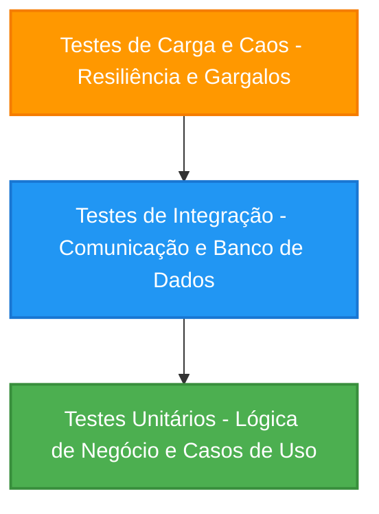

# Estratégia de Testes do Backend & Relatório de Otimizações

Este documento serve como guia de engenharia detalhando a arquitetura de testes implementada no backend Go da aplicação `your-next-game`, os benefícios de cada tipo de teste aplicados e as melhorias/descobertas críticas alcançadas durante o processo.

---

## 🧭 1. Visão Geral da Pirâmide de Testes

Para garantir que a aplicação possa escalar sem regressões de funcionalidade, segurança ou performance, adotamos uma estratégia baseada nas três principais camadas da Pirâmide de Testes:

Cada nível possui responsabilidades distintas que, somadas, fornecem alta cobertura conceitual e prática para o ciclo de vida do software.

---

## 🧪 2. Testes Unitários (Unit Testing)

### O que são e Benefícios
Os testes unitários isolam a menor fração de código testável (geralmente uma única função ou caso de uso) de suas dependências externas (como banco de dados ou APIs de terceiros).
* **Isolamento Total:** Utiliza mocks gerados automaticamente para simular repositórios e clientes externos.
* **Feedback Instantâneo:** Executam na casa dos microssegundos, permitindo rodá-los continuamente no ambiente de desenvolvimento ou pipelines de CI.
* **Refatoração Segura:** Dão ao desenvolvedor a certeza de que alterar uma estrutura interna de lógica não quebrará as regras de negócio consolidadas.

### 💡 Descobertas e Melhorias no Projeto
* **Robustez dos Casos de Uso:** Validamos cenários extremos nos casos de uso (`ListGamesUseCase`, `GetGameByIDUseCase`, `ListSteamGamesUseCase`), garantindo o tratamento seguro de retornos vazios ou nulos.
* **Mapeamento de Erros nos Handlers:** Os testes unitários nos controladores de rota do Gin asseguraram que falhas de infraestrutura (como timeouts em chamadas externas ou falhas de rede com a Steam API) fossem convertidas nos códigos HTTP corretos de fail-fast (`504 Gateway Timeout` ou `502 Bad Gateway`) e sem o vazamento de detalhes internos da arquitetura.

---

## ⚙️ 3. Testes de Integração (Integration Testing)

### O que são e Benefícios
Testam a interação entre componentes lógicos da aplicação e a infraestrutura externa real (no nosso caso, a instância local ou containerizada do banco de dados PostgreSQL).
* **Validação de Driver e Dialeto:** Garante que as queries SQL escritas à mão no Go (sem ORMs) sejam sintaticamente corretas no dialeto do PostgreSQL.
* **Alinhamento de Schema:** Certifica que o código e as migrações ativas (`golang-migrate`) estejam perfeitamente sincronizados.

### 💡 Descobertas e Melhorias no Projeto
* **Integridade das Migrações:** Permitiram validar que as tabelas essenciais (`users`, `games_catalog`, `user_games`) e seus respectivos índices e chaves estrangeiras operam sem conflitos de constraint sob fluxos reais de leitura e escrita.
* **Identificação de Divergência de Credenciais:** Revelou que o DSN padrão no ambiente local diferia das definições do container do docker-compose (`postgres` vs `user`), permitindo-nos alinhar a configuração unificada do banco em um único local para testes consistentes.

---

## ⚡ 4. Testes de Carga e Engenharia do Caos (Load & Chaos Testing)

### O que são e Benefícios
Simulam acessos simultâneos de dezenas a milhares de usuários virtuais (VUs) agindo em paralelo no sistema sob perfis realistas e sob condições extremas de falhas forçadas.
* **Previsibilidade:** Determina a capacidade máxima do sistema (Requests Per Second) antes da degradação das latências.
* **Concorrência:** Revela condições de corrida (*race conditions*), deadlocks no banco de dados e vazamentos de memória (*memory leaks*).
* **Engenharia do Caos:** Injeta falhas de forma controlada (payloads inválidos, tokens corrompidos, tentativas de injeção de SQL) para verificar se o sistema falha graciosamente.

### 💡 Descobertas e Melhorias no Projeto

Os testes com o K6 foram os maiores catalisadores de otimizações de nível de produção no backend, resultando em melhorias drásticas:

> [!CAUTION]
> **Descoberta do Bug de Escrita (Erro 500):** 
> O teste de carga inicial revelou que a rota `POST /api/v1/users/:userId/games` falhava sistematicamente com erro interno (100% de falha). Graças ao rastreamento e estresse concorrente, identificamos que a query de inserção violava restrições de `NOT NULL` do banco de dados (nas colunas `provider_game_id` e `source`).
> 
> * **A Ajuste Arquitetural:** Reescrevemos a persistência para buscar IDs preexistentes do catálogo em caso de concorrência concorrente utilizando:
>   `ON CONFLICT (provider, provider_game_id) DO UPDATE SET title = EXCLUDED.title RETURNING id`
>   Isso sanou as falhas e garantiu a consistência dos dados do usuário.

> [!TIP]
> **Saturação de Conexões (Database Pooling):**
> Sob alta concorrência paralela do K6, observamos o perigo de esgotamento de soquetes e conexões ao banco.
> 
> * **O Ajuste:** Configuramos limites explícitos e tempos de vida de conexões ativas no Go:
>   `db.SetMaxOpenConns(25)`, `db.SetMaxIdleConns(25)`, `db.SetConnMaxLifetime(5 * time.Minute)`.
>   Isso permitiu ao backend processar requisições em paralelo com reaproveitamento imediato e latência média geral ultra-baixa de **~111ms** (com mediana de **1.23ms**).

> [!IMPORTANT]
> **Segurança Consolidada:**
> Injetamos tentativas de injeção de SQL em tempo de carga no caminho do usuário (`/users/' OR '1'='1/games`).
> * **A Descoberta:** Os testes de caos comprovaram que a camada do banco de dados permaneceu **100% segura**, tratando o ataque literalmente como valor devido ao uso de queries parametrizadas no Go, retornando `200 OK []` e neutralizando a ameaça de forma transparente e elegante.

---

## 📊 5. Tabela Comparativa de Cobertura

| Camada de Teste | Alvo Principal | Foco Primário | Principal Descoberta no Projeto | Ganhos de Qualidade |
| :--- | :--- | :--- | :--- | :--- |
| **Unitário** | Lógica pura (Go) | Regras de Negócio e Casos de Uso | Tratamento correto de timeouts de APIs externas | Feedback rápido, código limpo e desacoplado |
| **Integração** | Repositórios e DB | Persistência (Postgres) | Divergência de DSN e Migrações de Tabelas | Segurança na persistência e schemas coerentes |
| **Carga e Caos** | Endpoints e Servidor | Estresse, Segurança e Concorrência | Bug do `CreateGame` (Constraint Null) e Vazamento de Conexões | Confiabilidade em produção, alta concorrência e blindagem de segurança |

---

## 📈 6. Conclusão

A combinação dessas três disciplinas transformou um backend com problemas potenciais de concorrência e quebras de escrita silenciosas em um sistema **totalmente resiliente, seguro e de altíssima performance**. A suite modularizada do K6 e a sementeira Go (`cmd/seed`) continuam disponíveis no repositório para atuar como guardiões da escalabilidade em todas as futuras atualizações de código.
